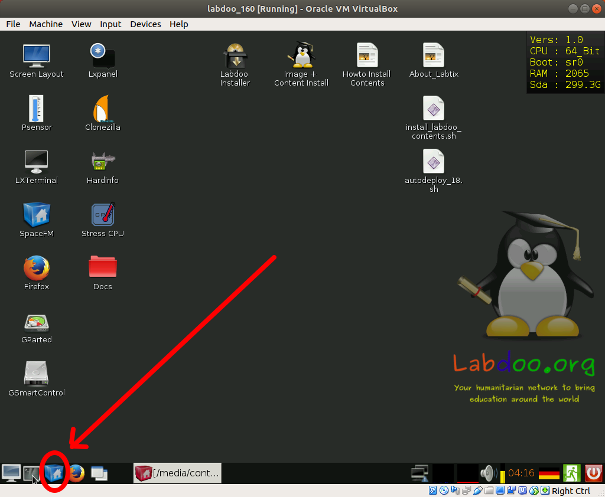
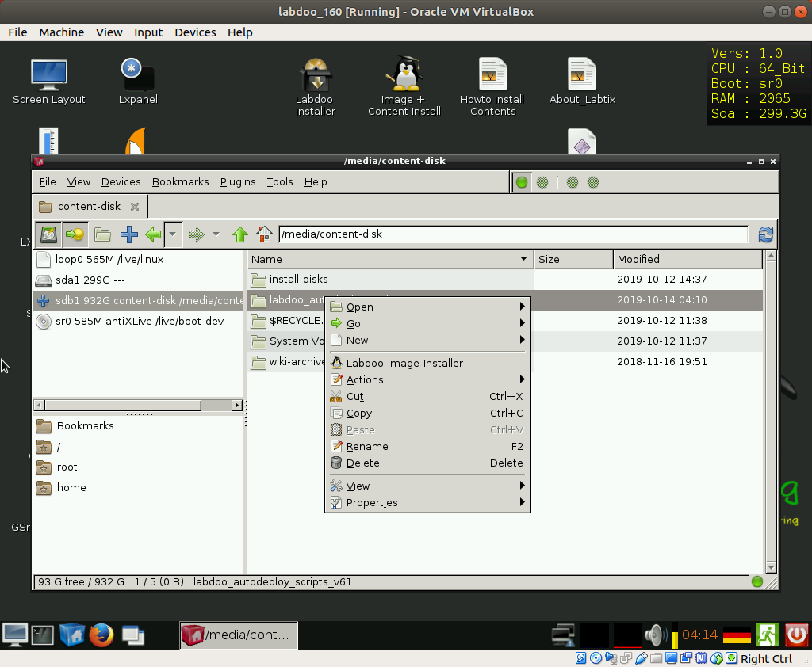

UPDATED!!! Working with Labdoo 20
===========

Description
===========

These 2 bash scripts are designed to automate the restoration of the
images and the content of the labdoo Images shared under http://ftp.labdoo.org/download/install-disk/
allowing to perform a complete end-to-end sanitazion of the laptop in an
unattended way.

### **Autodeploy.sh** : 

shredding of the harddrive (optional)

restoration of the selected image

configuration of a new hostid

additional customizations (removal of autostart programs)

deployment of all the additional kiwix contents (shared for Labdoo under http://ftp.labdoo.org/download/install-disk/additional_kiwix_contents )of the languages you choose automatically 

### **install_labdoo_contents_kiwix.sh** :

restore all contents that fit on the HD (based upon a configurable
“priority list” of the contents \[kiwix\] downloaded in the
HD) that fit in the HD (leaving an acceptable \[and configurable\]
margin of free space)

Where to obtain the latest version of the scripts
=================================================

You can download or contribute to the code on the github project:

[*https://github.com/jprisab/labdoo\_labtix*](https://github.com/jprisab/labdoo_labtix)

Or you can download the latest released stable version for labdoo ftp
server:

[*http://ftp.labdoo.org/download/install-disk/*](http://ftp.labdoo.org/download/install-disk/)

A version of these scripts is included as well in the Labtix iso CD but
because of the release cycle of the Labtix solution it might not contain
the latest corrections/features and hence it is recommended to always
use the newer version of the scripts as described on the chapter
“Copying the scripts after booting Labtix”

Starting the scripts after booting Labtix
========================================

for being sure I work with the latest version of the scripts \[to be
downloaded from
[*http://ftp.labdoo.org/download/install-disk/autodeploy_scripts*](http://ftp.labdoo.org/download/install-disk/)
\](always may include some improvement or the addition of the extra
content of a new language…) I always have them copied in the same USB HD
where I have the Images and the content I want to restore

1.- Open the File Explorer

{width="2.745138888888889in"
height="2.2569444444444446in"}

2.- select the directory where the scripts are copied

{width="2.4972222222222222in"
height="2.053472222222222in"}

3.- call launch_autodeploy.sh

{width="2.4972222222222222in"
height="2.053472222222222in"}

------------

DISCLAIMER: we are under constant development

latest updated version of this document was for scripts version v2.0

Please visit labdoo.org to keep up with the new developments and submit
your ideas in the forums (and report any bug you may find), submit any
doubt you might have to labdoo support wall

https://www.labdoo.org/content/labdoo-global-support-lgs/activities

Please feel free to modify any script to adapt to your requirements and
preferences
