UPDATED!!! Working with Labdoo 20
===========

Description
===========

These 2 bash scripts are designed to automate the restoration of the
images and the content of the labdoo Images shared under http://ftp.labdoo.org/download/install-disk/
allowing to perform a complete end-to-end sanitazion of the laptop in an
unattended way.

### **Autodeploy.sh** : 

shredding of the harddrive (optional)

restoration of the selected image

configuration of a new hostid

additional customizations (removal of autostart programs)

deployment of all the additional kiwix contents (shared for Labdoo under http://ftp.labdoo.org/download/install-disk/additional_kiwix_contents )of the languages you choose automatically 

### **install_labdoo_contents_kiwix.sh** :

restore all contents that fit on the HD (based upon a configurable
“priority list” of the contents \[kiwix\] downloaded in the
HD) that fit in the HD (leaving an acceptable \[and configurable\]
margin of free space)

Where to obtain the latest version of the scripts
=================================================

You can download or contribute to the code on the github project:

[*https://github.com/jprisab/labdoo\_labtix*](https://github.com/jprisab/labdoo_labtix)

Or you can download the latest released stable version for labdoo ftp
server:

[*http://ftp.labdoo.org/download/install-disk/*](http://ftp.labdoo.org/download/install-disk/)

A version of these scripts is included as well in the Labtix iso CD but
because of the release cycle of the Labtix solution it might not contain
the latest corrections/features and hence it is recommended to always
use the newer version of the scripts as described on the chapter
“Copying the scripts after booting Labtix”

Copying the scripts after booting Labtix
========================================

for being sure I work with the latest version of the scripts \[to be
downloaded from
[*http://ftp.labdoo.org/download/install-disk/autodeploy_scripts*](http://ftp.labdoo.org/download/install-disk/)
\](always may include some improvement or the addition of the extra
content of a new language…) I always have them copied in the same USB HD
where I have the Images and the content I want to restore

1.- Open the File Explorer

{width="2.745138888888889in"
height="2.2569444444444446in"}

2.- copy the newer scripts to the desktop

{width="2.4972222222222222in"
height="2.053472222222222in"}

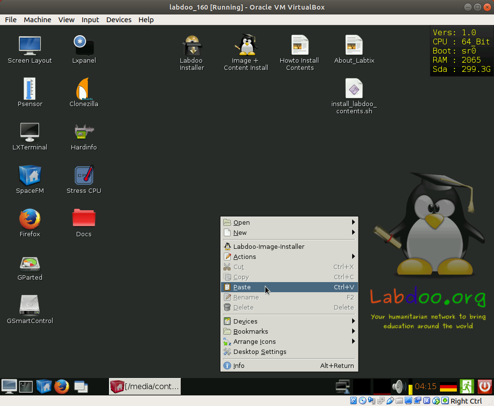{width="2.170138888888889in"
height="1.7840277777777778in"}

Using autodeploy.sh
=======================

Open the command console (come on, this is not rocket science...)

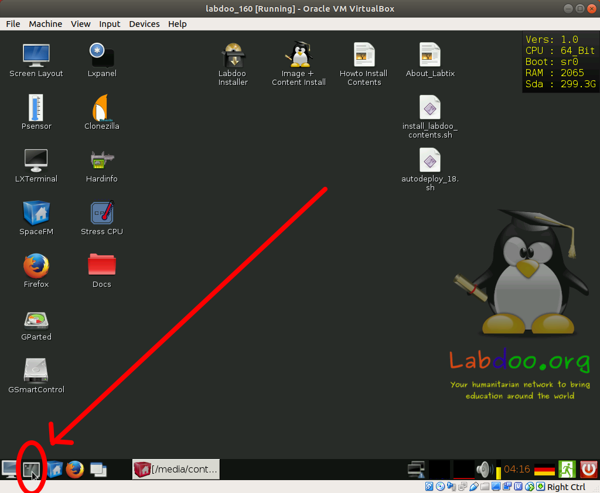{width="2.564583333333333in"
height="2.1083333333333334in"}

And then just type:

**cd Desktop**

press enter

**bash autodeploy\_18.sh**

press enter

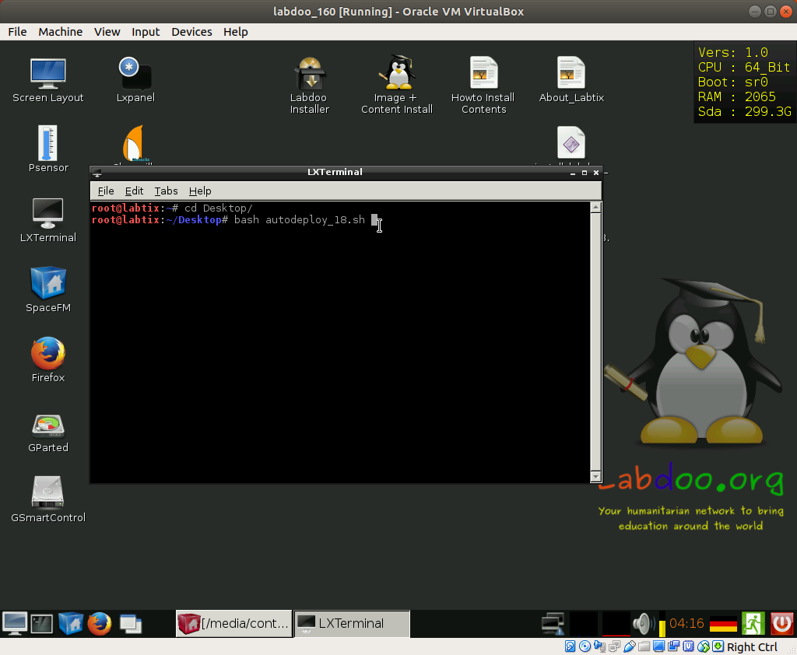{width="2.4069444444444446in"
height="1.9791666666666667in"}

The script is running and you just have to answer carefully the
questions (specially the first ones related to the units to delete and
to restore from)

########## Question 1: Select the disk you want to ERASE and RESTORE the image in

this is easy, the script will show you the name of the units you see and
the size, pick the one that is not the USB HD (and you should know how
big is your USB HD… so the other one \[99% of the time is the one also
shown in the Labtix desktop in the corner up right (here you see it is
indicating sda, and also I know that my USB HD is 931 Gb, so for sure I
have to put sda)

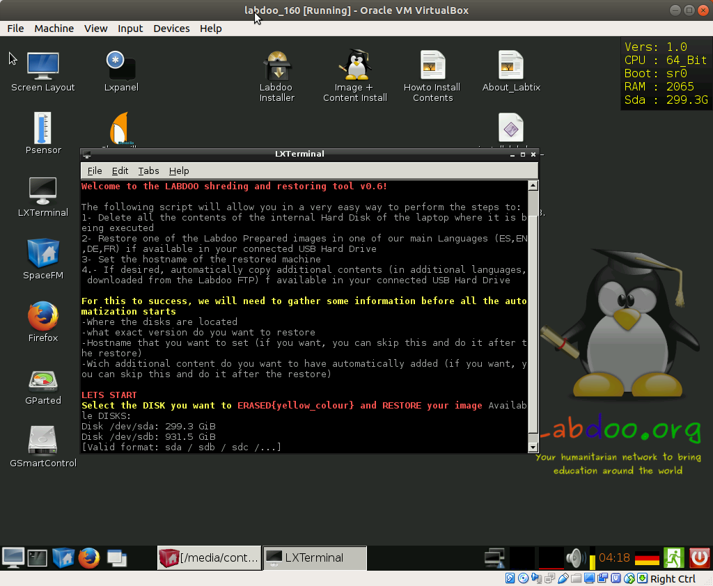{width="3.842361111111111in"
height="3.1590277777777778in"}

########## Question 2: Select the disk you want to use as SOURCE

So what is the unit where you have the images… in this case, as
explained it will be sdb

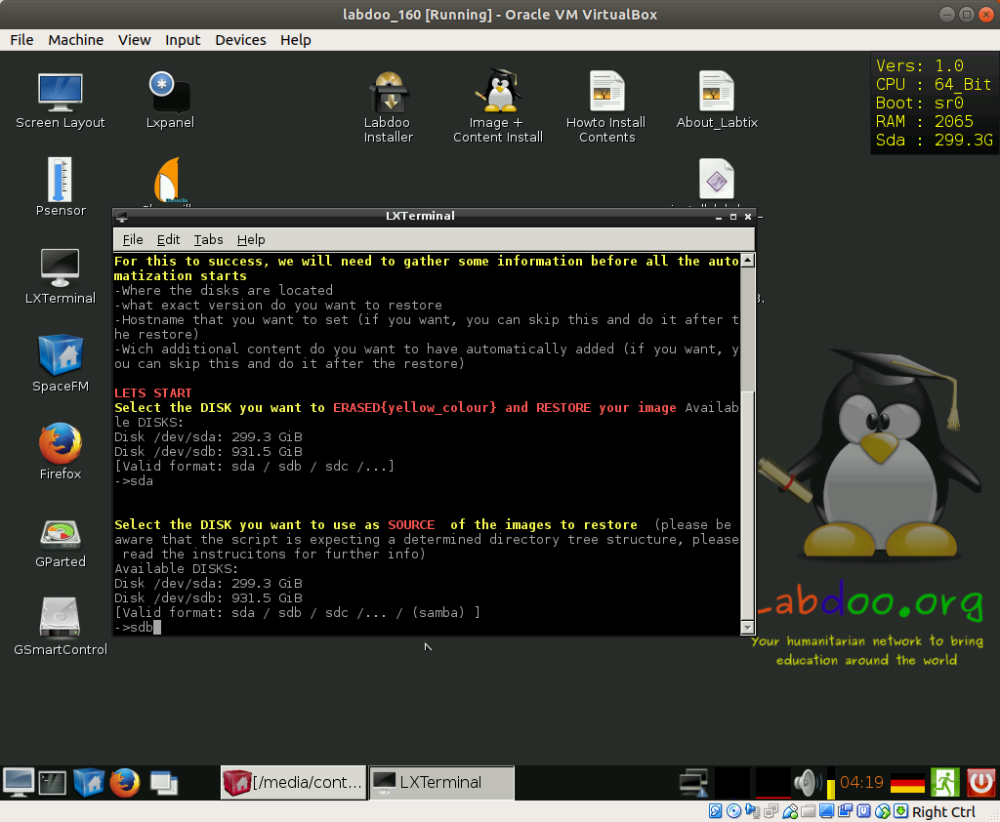{width="3.3895833333333334in"
height="2.7868055555555555in"}

########## Question 3: In which disk you have the additional contents

{width="3.897222222222222in"
height="3.2041666666666666in"} If you have the additional contents also
in a different USB HD (that of course at this time should already be
plugged in), you should specify here the unit name of that disk (sdc? It
will appear also listed...), if you have the contents in the same HD as
the images, just press enter, the script will recognize them…

1.  ### 

    ### 

    ### 

    ### 

    ### 

    ### 

    ### 

    1.  ########## Question 4: Select the image you want to restore

The script will read the images available in the USB HD and list them,
just select the number corresponding to the image you want to restore
and click enter

By this time you should already know the naming convention for the
images, but the script will remind you:

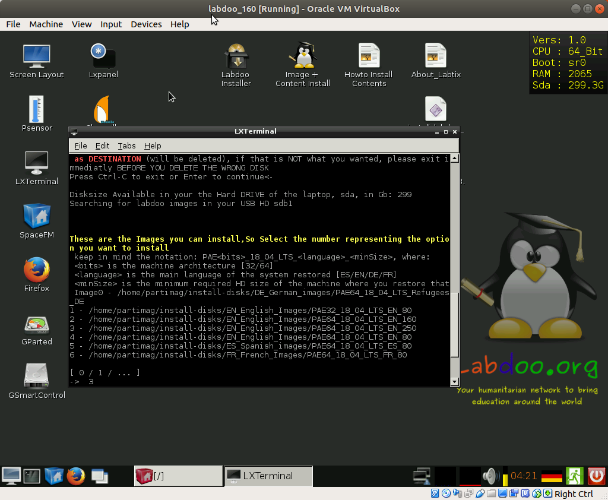{width="3.6875in" height="3.0319444444444446in"}

########## Question 5: Set a hostid automatically

The script asks you if you already want to assign a specific hostid
during the restoration, this yway you will not need to change it
afterwards in the system, just put the 5 numbers corresponding to the
labdoo ID and click enter

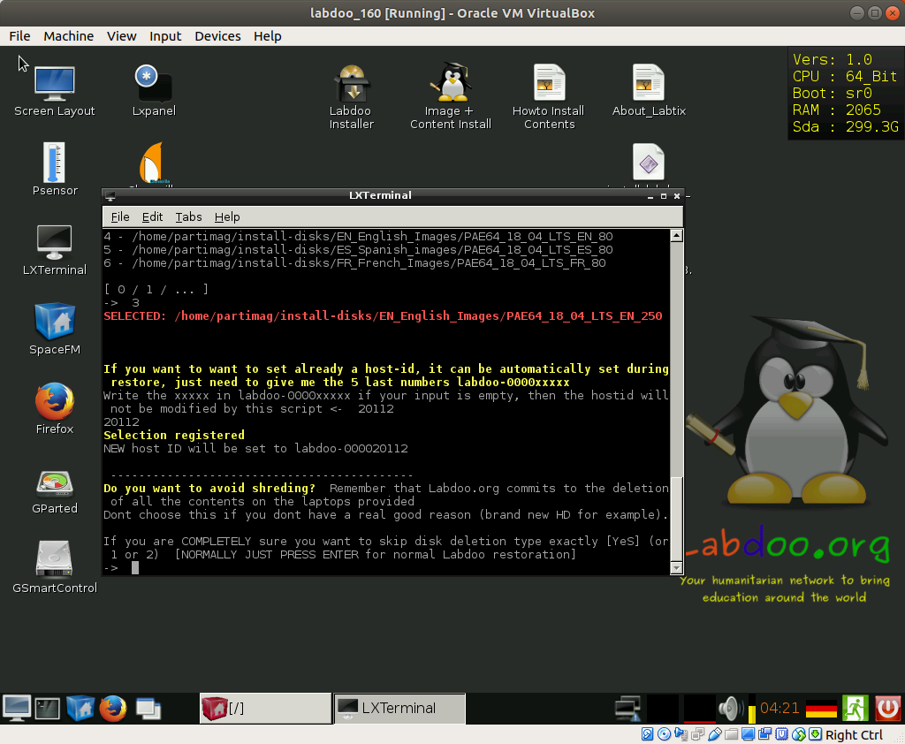{width="2.765277777777778in"
height="2.2736111111111112in"}

########## Question 6: Possibility to skip the shredding

Press directly Enter to leave the normal configuration (shredding the
disk before restoring)

(**ONLY Select something different if the laptop has already been erased
previously or you are using a new HD, remember that deletion of data in
donated laptops is mandatory**)

{width="3.19375in"
height="2.6256944444444446in"}

########## Question 7: Installation of additional contents

Just enter the code languages of the additional contents you want to
install separated by comma(in the example I select to install French and
Swahili)

(**very recommendable, to include as much educational content as
possible!!**) \[it does it by automatically calling the
install\_content\_labdoo.sh script\]

currently supported languages:

**\[ES / EN / SW / AR / HI / DE / FR / NE / ID / PT / ZH / RU / RO / IT
/ FA / MY / HU / ZU / SR / UK\]**

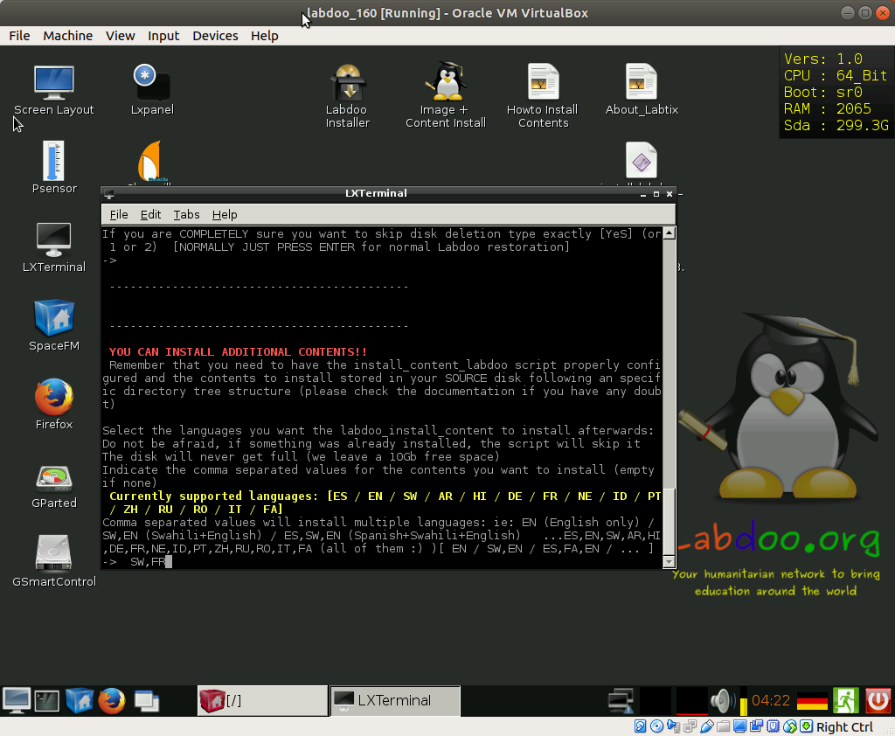{width="3.4715277777777778in"
height="2.854861111111111in"}

-

########## Question 8: what to do when the process finishes

I personally find it usefull sending the laptop to sleep, since it
allows you to save power once finished, but also to wake it up
afterwards and see how the process finished \[as opposed of just having
it shutted down\]

Just select the option you prefer and press enter

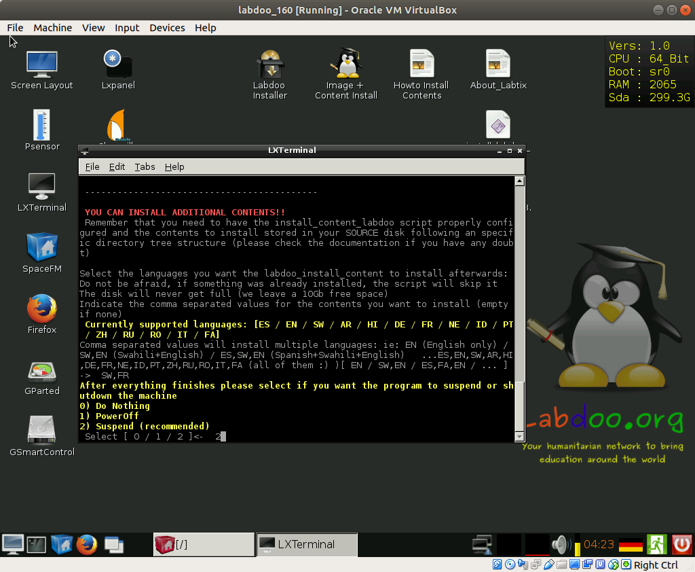{width="5.070138888888889in" height="4.16875in"}

Using install\_content\_labdoo.sh
=================================

This script is totally automated and does not require any input from the
user, if you like the configuration (or after you have setted to your
taste) you just have to invoke it.

It will deploy the contents, adapt the index.html file so that only the
installed content is showd in firefox and run once again the “set
permissions correctly” script to avoid permission problems.\
**It will help you make sure that the students get all the possible
content, after all, it was not so easy to bring the laptop to them**

### Configuration Parameters

You can reconfigure the following information about the content files
you want to deploy but by default the configuration matches the images
offered in the FTP server \[and the ones that are installed in the
“Stadard labdoo USB HD”\] so do not change it if you dont really need:

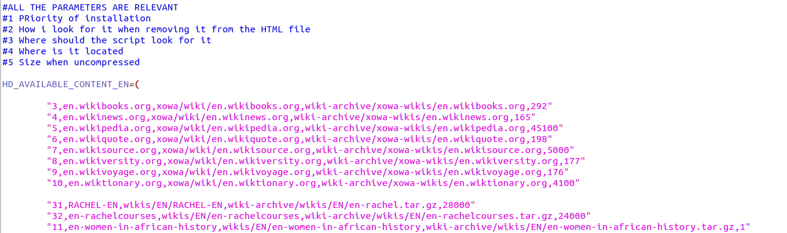{width="6.6930555555555555in"
height="1.9861111111111112in"}

You might change at the priority order on which you want to have things
deployed (until HD is full), I have given priority to the wikis and the
Rachel contents as well as the “women in Africa history”, but you might
change it at will (do not assign same number to different contents,
otherwise one of then will be skipped)

Dont worry about the size, the script will try to install everything (if
only 10 Gb are avialiable, and the first thing you have selected takes
20G, it will not break, will just skip it, and see if the next content
in your priority list fits)

The installation will leave allways the space configured as
MB\_TO\_BE\_LEFT as free, you might change this value as well

### Using the script

This is an easy one, plug the USB HD, invoke the script and go to
sanitize in between a new laptop :)

Current supported languages:

**\[ES / EN / SW / AR / HI / DE / FR / NE / ID / PT / ZH / RU / RO / IT
/ FA / MY / HU / ZU / SR / UK\]**

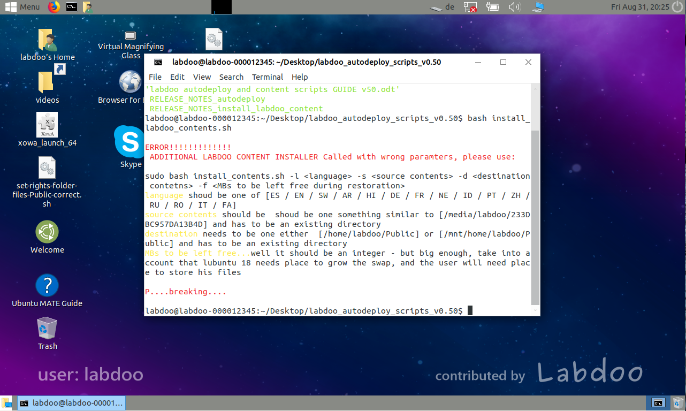{width="6.6930555555555555in"
height="4.009027777777778in"}

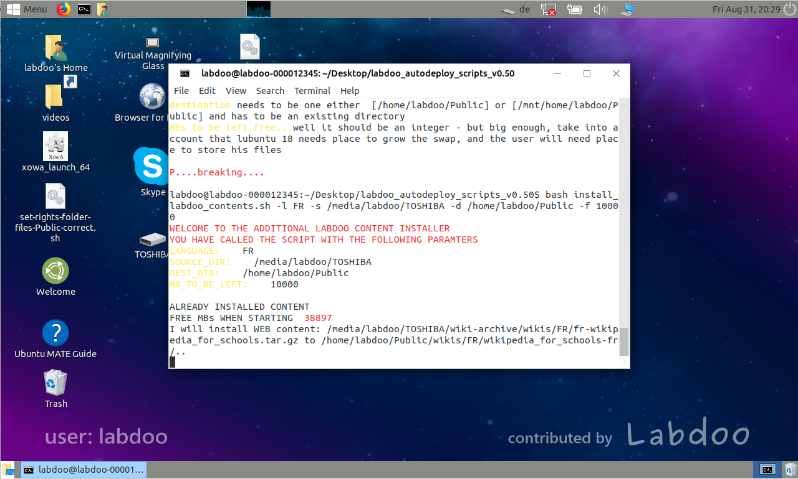{width="6.6930555555555555in"
height="4.0256944444444445in"}

DISCLAIMER: we are under constant development

latest updated version of this document was for scripts version v0.62

contents of the package:

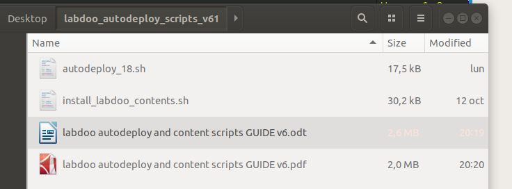{width="6.6930555555555555in"
height="2.472916666666667in"}

Please visit labdoo.org to keep up with the new developments and submit
your ideas in the forums (and report any bug you may find), submit any
doubt you might have to labdoo support wall

https://www.labdoo.org/content/labdoo-global-support-lgs/activities

Please feel free to modify any script to adapt to your requirements and
preferences
